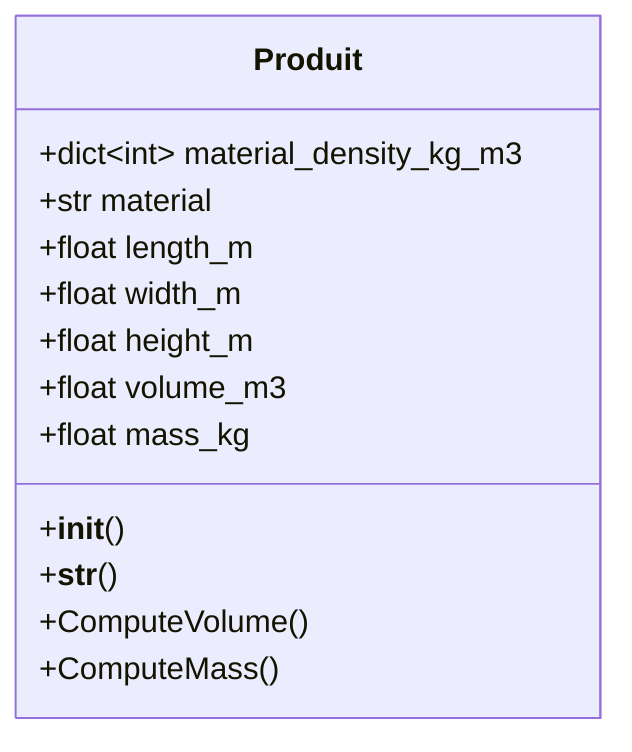

# Exercice Class Produit


## material_density_kg_m3

| Bois | Verre | Acier | Aluminium |
|---|---|---|---|
| 700 | 2500 | 7700 | 2700 |

## constructeur de la class Produit

doit définir : 
- **material**
- les dimensions en millimetre pour un stockage en metre : **length_m** + **width_m** + **height_m**

les attributs **volume_m3** et **mass_m3** doivent être calculés à partir des dimensions du produit et de la densité du matériaux

## affichage de la class Produit

| material | length_m | width_m | height_m | volume_m3 | mass_kg |
|---|---|---|---|---|---|
| "Bois" | 0.5 | 0.5 | 0.5 | 0.125 | 87.5 |

mise en forme => [ Bois ] length=0.5 width=0.5 height=0.5 0.125m3 87.5kg

## ComputeVolume()

- calcul du volume en m3 du parallélépipède rectangle correspondant aux dimensions

## ComputeMass()

- calcul de la masse en kg du produit suivant la densité du matériaux **material** 

## Jeu de test

```
    p1 = Produit("Bois", 500, 500, 500)

    print(p1)

    p1.length_m = 1
    print(p1)

    p1.ComputeVolume()
    print(p1)

    p1.volume_m3 = p1.ComputeVolume()
    p1.mass_kg = p1.ComputeMass()
    print(p1)
```
