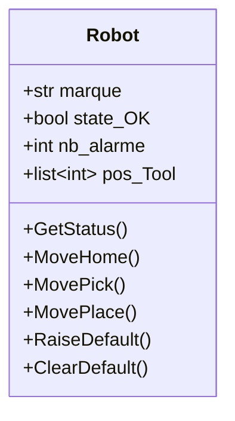

# Exercice Class Robot


marque = FANUC

## Affichage GetStatus()

| marque | state_OK | nb_alarme | X | Y | Z |
|---|---|---|---|---|---|
| FANUC | True | 0 | 10 | 10 | 500 |

mise en forme => FANUC Status OK (0) Position X=10 Y=10 Z=500

## Valeurs position Tool

| Position  | X  | Y  |  Z |
|---|---|---|---|
| init  | 0 | 0 | 0 |
| Home  | 10 | 10 | 500 |
| Pick  | 100 | 30 | 120 |
| Place  | 100 | 150 | 230 |

## Gestion defaut

### RaiseDefault()

- state_OK = False 
- nb_alarme = nb_alarme + 1

### ClearDefault()

- state_OK = True 

## Jeu de test

```
    print(Robot.marque) # utilisation attribut de class sans instanciation

    rob1 = Robot() # premiere instance de robot
    rob2 = Robot() # seconde instance de robot

    # Ordres sur robot 1
    rob1.GetStatus()
    rob1.MoveHome()
    rob1.RaiseDefault()
    rob1.GetStatus()
    rob1.ClearDefault()
    rob1.GetStatus()

    # Ordres sur robot 2
    rob2.GetStatus()
    rob2.RaiseDefault()
    rob2.GetStatus()
```
